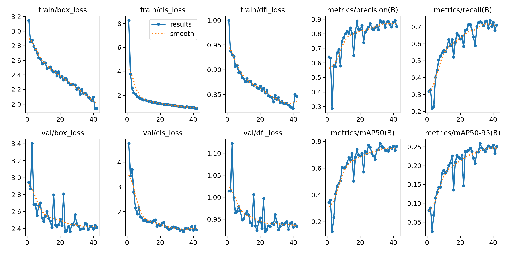
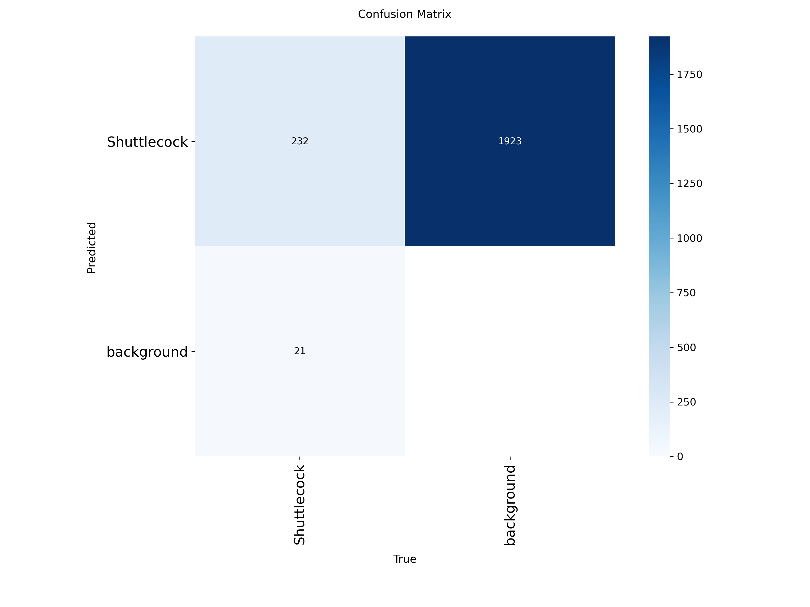

# 🏸 Badminton Shuttlecock Detection with YOLOv8

Real-time shuttlecock detection in badminton match footage using a fine-tuned YOLOv8 model. Achieves 76.4% mAP@50 on a diverse test set spanning professional broadcasts (BWF World Tour) and amateur match recordings.


## 🎯 Motivation

Shuttlecock detection is a genuinely hard computer vision problem:
- **Small object size** — shuttlecocks typically occupy less than 1% of the frame
- **High motion blur** — shuttle speeds regularly exceed 300 km/h during smashes
- **Cluttered backgrounds** — busy stadiums, scoreboards, sponsor logos
- **Variable lighting** — from bright arenas to dimly-lit local gyms

As a competitive badminton player (Men's Singles Champion, Belt and Road International Youth Badminton Challenge — Jiangsu Provincial Sports Bureau sanctioned), this project sits at the intersection of a sport I know deeply and a computer vision problem worth solving.

## 📊 Results

| Metric | Value |
|--------|-------|
| **mAP@50** | 0.764 |
| **mAP@50-95** | 0.250 |
| **Precision** | 0.887 |
| **Recall** | 0.719 |
| **Inference Speed** | 1.7 ms/image (~588 FPS on Tesla T4) |
| **Model Size** | 3.0M parameters, 8.1 GFLOPs |

### Training Curves


### Confusion Matrix


## 🖼️ Real-World Test Predictions

The model generalizes across amateur recordings and professional broadcasts without additional fine-tuning:


## 🛠️ Tech Stack

- **Framework:** PyTorch (via Ultralytics YOLOv8)
- **Model:** YOLOv8n (nano) — COCO-pretrained, fine-tuned on custom dataset
- **Dataset:** 3,067 annotated images (2,685 train / 254 valid / 128 test) — sourced from Roboflow Universe under Public Domain license
- **Training:** Google Colab, Tesla T4 GPU
- **Libraries:** `ultralytics`, `opencv-python`, `roboflow`, `torch`

## 🚀 Quick Start

### Clone and install
```bash
git clone https://github.com/ZAYN005/badminton-shuttlecock-detection.git
cd badminton-shuttlecock-detection
pip install ultralytics
```

### Run inference on an image
```python
from ultralytics import YOLO

model = YOLO('best.pt')
results = model.predict('your_image.jpg', conf=0.25, save=True)
```

### Run on a video
```python
model.predict('match_video.mp4', save=True)
```

## 🧠 Training Details

```python
from ultralytics import YOLO

model = YOLO('yolov8n.pt')
results = model.train(
    data='data.yaml',
    epochs=50,
    imgsz=640,
    batch=16,
    patience=10
)
```

- **Epochs:** 50 (early-stopped at 42 due to validation plateau)
- **Batch size:** 16
- **Image size:** 640×640
- **Optimizer:** SGD (Ultralytics default)
- **Training time:** ~28 minutes on Tesla T4

## 🔬 Challenges & Learnings

**Small object detection:** Shuttlecocks are often 15–30 pixels in a 640×640 frame. YOLOv8's anchor-free head handled this reasonably well, but the low recall (0.72) and low mAP@50-95 (0.25) confirm that small-object precision is the main bottleneck. The confusion matrix shows the model rarely fires false positives (only 21) but misses a significant number of shuttlecocks — it's a conservative detector.

**Motion blur:** The model handles stationary and mid-flight shuttles well, but struggles with heavily blurred smash trajectories where the shuttle streaks across multiple pixels.

**Class imbalance:** Single-class training simplified the problem but limits the model's practical utility. Extending to multi-class detection (player, racket, court lines) is a natural next step.

## 🔮 Future Work

- [ ] Higher input resolution (960 or 1280) to improve small-object recall
- [ ] Upgrade to YOLOv8s/m for improved mAP at the cost of speed
- [ ] Multi-class detection: player, racket, court lines, net
- [ ] Trajectory tracking with ByteTrack or DeepSORT for shot analysis
- [ ] Mobile deployment: YOLOv8 → TensorFlow Lite → Android
- [ ] Rally statistics: shot count, court coverage, average rally length

## 📚 Dataset Credits

Dataset sourced from [Roboflow Universe](https://universe.roboflow.com/badyfriends/badminton-shuttlecock-dv7zr) under Public Domain license. Thanks to the badyfriends workspace for open-sourcing the annotations.

## 👤 Author

**Zain Ali**
- Computer Science undergraduate, Nanjing Tech University (Class of 2027)
- Competitive badminton player, provincial champion (Jiangsu, 2024)
- 📧 zain01chaudhary@gmail.com
- 🔗 [GitHub](https://github.com/ZAYN005)

---

